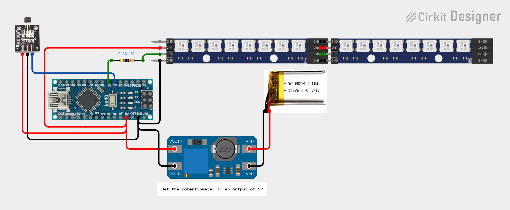
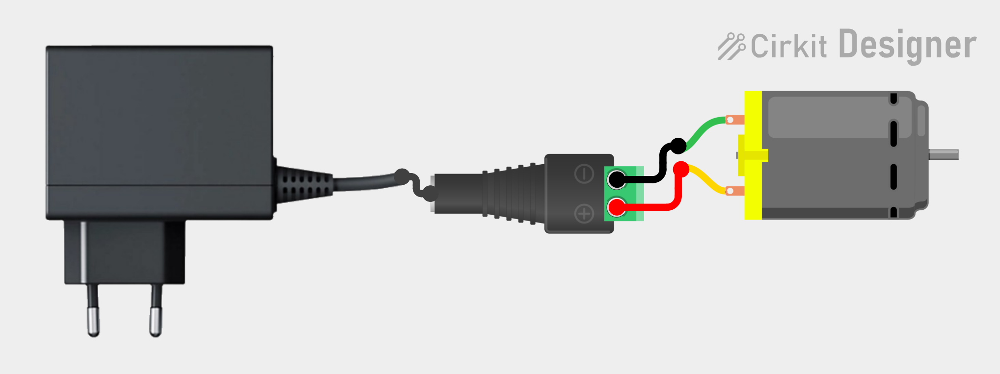

<h1 align="center">HoloC</h1>

HoloC - a simple holographic display project.

---

## Project Overview
HoloC is a project creating a persistence-of-vision (PoV) display. By rapidly spinning an LED arm and synchronizing its updates with exact rotational angles, the display produces the optical illusion of a floating, semi-transparent graphic in mid-air.

### Features
*   **High-Speed PoV Rendering:** Precise rotation tracking and LED synchronization using a Hall-effect sensor.
*   **Image Conversion Tool:** Python script to easily convert PNG images directly into microcontroller-ready C++ headers.

### Hardware
*   1x **Arduino Nano**
*   1x **1S Li-Po Battery (3.7V, ~250-500mAh)**
*   1x **MT3608 DC-DC Step-Up Boost Converter Module**
*   1x **470Ω resistor**
*   2x **WS2812B-8 Addressable LED Strip Module**
*   1x **KY-003 - 3144 Hall-Effect Sensor Module**
*   1x **4x4mm Cylindrical Neodymium Magnet**
*   1x **DC Motor 300**
*   1x **2.1x5.5mm DC Power Jack Plug Female Adapter**
*   1x **5V 2A Power Adapter**
*   1x **3D Printed Rotor**
*   1x **3D Printed Spacer**
*   1x **3D Printed Stand**

### Schematics

 

### Future Goals
*   **Fully Volumetric 3D Display:** Upgrading from a 2D planar rotor to a multi-layered volumetric display matrix.
*   **Desktop Application:** Developing a user-friendly GUI tool to easily design, slice, and stream custom images and 3D models directly to the device.

### Disclaimer
The project is a work in progress and the current implementation may differ drastically from the final version. Features, hardware, schematics, and code are subject to significant changes before the final release.